https://www.perplexity.ai/search/your-a-well-versed-senior-soft-vrS4UJjUQmiltJ4iuzSIow

# Model Context Protocol (MCP): A Comprehensive Guide

## Table of Contents

1. [Essential Terms and Definitions](#essential-terms-and-definitions)
2. [Introduction to MCP](#introduction-to-mcp)
3. [Understanding the General Architecture](#understanding-the-general-architecture)
4. [Core Components Deep Dive](#core-components-deep-dive)
5. [Communication Protocol](#communication-protocol)
6. [Protocol Lifecycle](#protocol-lifecycle)
7. [MCP Capabilities](#mcp-capabilities)
8. [Implementation Examples](#implementation-examples)
9. [Complete NestJS MCP Server Implementation](#complete-nestjs-mcp-server-implementation)
10. [References](#references)

---

## Essential Terms and Definitions

Before diving into the Model Context Protocol, it's crucial to understand the key terminology that forms the foundation of this documentation:

**Model Context Protocol (MCP)**: An open standard that enables AI applications to securely connect to external data sources, tools, and systems in a standardized way[^1]. Think of it as a "USB-C port for AI applications"[^2].

**JSON-RPC 2.0**: A lightweight remote procedure call (RPC) protocol encoded in JSON that serves as the foundation for all MCP communication[^3]. It defines three message types: requests, responses, and notifications.

**Host**: The user-facing AI application that end-users interact with directly, such as Claude Desktop, AI-enhanced IDEs, or custom AI agents[^4]. The host manages user interactions and orchestrates communication with MCP servers.

**Client**: A component embedded within the host application that maintains a 1:1 connection with a specific MCP server[^5]. It handles protocol-level details and acts as an intermediary between the host and server.

**Server**: An external program or service that exposes capabilities (tools, resources, and prompts) to AI models via the MCP protocol[^6]. Servers can run locally or remotely and provide access to specific external systems.

**Transport Layer**: The communication mechanism between clients and servers, supporting STDIO (Standard Input/Output) for local integrations and HTTP+SSE (Server-Sent Events) for remote connections[^7].

**Resources**: Structured external data that servers expose to clients, such as files, database content, API responses, or any other information that can be read by the AI model[^8].

**Tools**: Executable functions or actions that the AI model can invoke to perform operations on external systems, such as sending emails, creating files, or calling APIs[^9].

**Prompts**: Reusable templates or structured instructions that help guide AI model interactions, providing consistent ways to invoke specific behaviors or responses[^10].

**Session**: A stateful connection between a client and server that maintains context throughout the interaction, unlike traditional stateless HTTP requests[^11].

**Capabilities**: The set of features and operations that an MCP server advertises to clients during the initialization phase, defining what the server can do[^12].

---

## Introduction to MCP

The Model Context Protocol (MCP) represents a paradigm shift in how Large Language Models (LLMs) interact with external systems and data sources. Developed by Anthropic and released as an open standard, MCP addresses the fundamental challenge of connecting AI models with the vast ecosystem of tools, databases, APIs, and services they need to perform real-world tasks[^13].

### The Problem MCP Solves

Traditional AI integrations require custom implementations for each data source or tool, creating an M×N complexity problem where M applications need to connect to N services[^14]. This approach leads to:

- **Fragmented integrations**: Each AI application needs separate connectors for every external service
- **Security concerns**: Inconsistent authentication and authorization mechanisms
- **Maintenance overhead**: Multiple codebases to maintain for similar functionality
- **Limited scalability**: Adding new integrations requires extensive development work

### MCP's Solution

MCP transforms this into an M+N problem by providing a standardized protocol that both AI applications and external services can implement once[^15]. This creates:

- **Universal connectivity**: Any MCP-compatible AI application can connect to any MCP server
- **Standardized security**: Consistent authentication and permission models
- **Simplified development**: Developers build against a single, well-defined protocol
- **Ecosystem growth**: New integrations benefit the entire MCP ecosystem

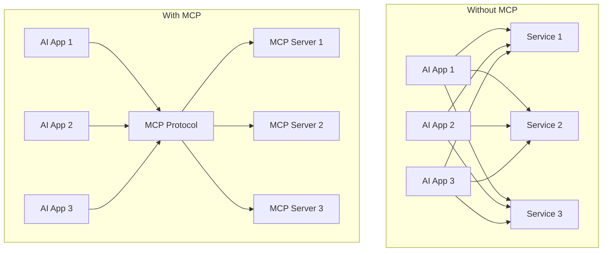

### Real-world Applications

MCP enables numerous practical applications:

- **Development environments**: AI-powered IDEs like Cursor can access project files, run tests, and interact with version control systems
- **Business intelligence**: AI assistants can query databases, generate reports, and analyze data across multiple systems
- **Workflow automation**: AI agents can coordinate tasks across different platforms like Slack, Google Drive, and project management tools
- **Personal productivity**: AI assistants can manage calendars, emails, and documents with appropriate permissions

---

## Understanding the General Architecture

The Model Context Protocol follows a clean, three-tier architecture that separates concerns and enables secure, scalable integrations. This architecture is inspired by successful protocols like the Language Server Protocol (LSP)[^16].

### Architectural Overview

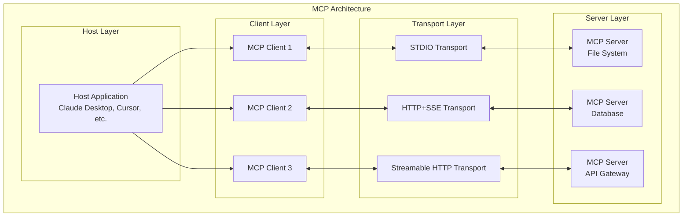

### Component Responsibilities

**Host Application**: 
- Manages user interface and interactions
- Coordinates multiple MCP clients
- Implements security policies and permission controls
- Orchestrates AI model integration
- Presents results to users in coherent formats

**MCP Client**:
- Maintains dedicated connection to one MCP server
- Handles JSON-RPC protocol communication
- Manages session state and lifecycle
- Translates between host requirements and MCP protocol
- Provides error handling and recovery

**MCP Server**:
- Exposes specific capabilities through standardized interfaces
- Implements business logic for tools, resources, and prompts
- Manages authentication and authorization
- Handles concurrent requests and session management
- Provides capability discovery and metadata

### Communication Flow

The interaction between components follows a well-defined pattern:

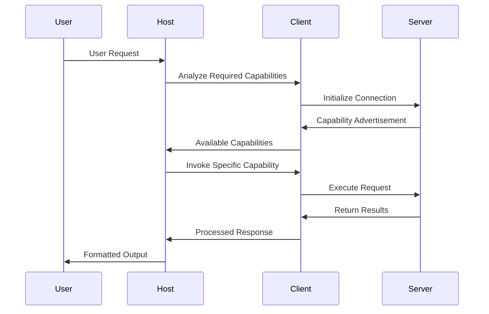

### Design Principles

The MCP architecture embodies several key design principles:

**Separation of Concerns**: Each component has a well-defined responsibility, making the system easier to understand and maintain.

**Stateful Sessions**: Unlike REST APIs, MCP maintains session context, enabling more sophisticated interactions and performance optimizations.

**Security by Design**: The architecture enforces security boundaries between components, with explicit permission models and sandboxing capabilities.

**Composability**: Multiple servers can be combined to create complex workflows, with the host orchestrating interactions between different services.

---

## Core Components Deep Dive

### Host Applications

Host applications serve as the primary interface between users and the MCP ecosystem. They are responsible for integrating AI models with MCP capabilities while providing a seamless user experience.

#### Key Responsibilities

**User Interface Management**:
- Present AI responses and tool outputs in user-friendly formats
- Handle user permissions and consent for external tool access
- Provide configuration interfaces for MCP server management
- Display progress indicators and status updates during tool execution

**AI Model Integration**:
- Process user queries and determine when external tools are needed
- Format MCP responses for consumption by language models
- Implement context management for multi-turn conversations
- Handle model-specific prompt engineering and response formatting

**Security and Permissions**:
- Implement user consent mechanisms for tool access
- Enforce security policies and access controls
- Provide audit trails for tool usage
- Manage authentication credentials for MCP servers

#### Popular Host Applications

- **Claude Desktop**: Anthropic's desktop application with built-in MCP support
- **Cursor**: AI-powered code editor with MCP integration for development tools
- **Continue.dev**: VS Code extension providing AI assistance with MCP capabilities
- **Custom Applications**: Built using frameworks like LangChain or smolagents

### MCP Clients

MCP clients are embedded components within host applications that handle the technical details of MCP communication. Each client maintains a dedicated connection to a single MCP server.

#### Client Architecture

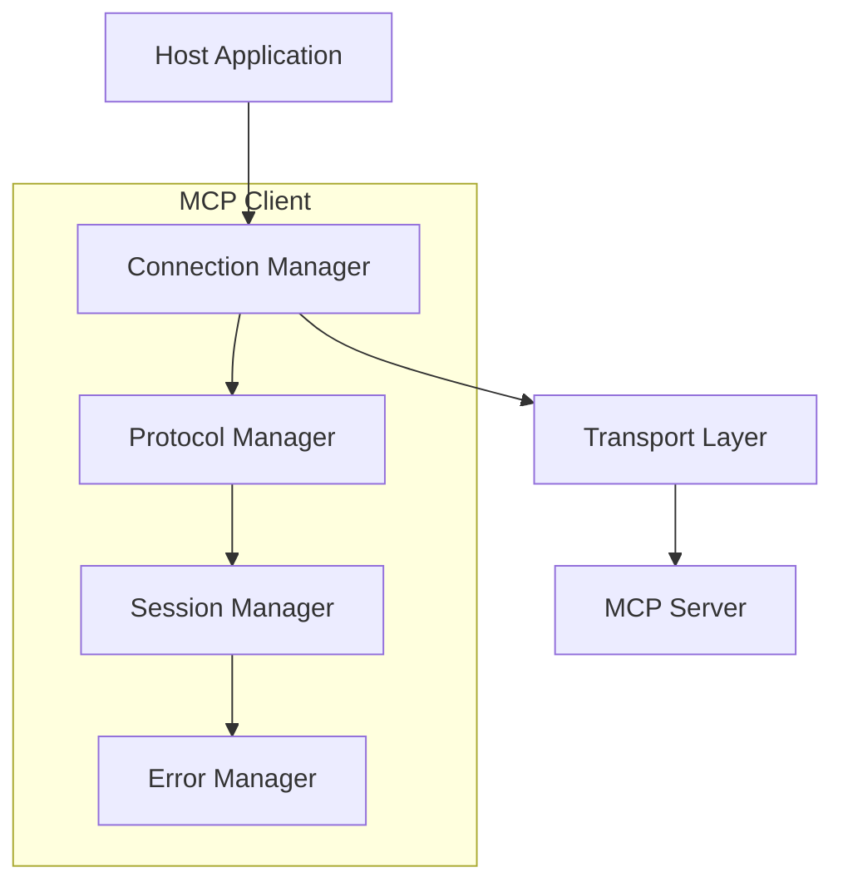

#### Core Functions

**Connection Management**:
- Establish and maintain connections to MCP servers
- Handle connection pooling and lifecycle management
- Implement reconnection logic for network failures
- Support multiple transport protocols (STDIO, HTTP+SSE, Streamable HTTP)

**Protocol Handling**:
- Serialize/deserialize JSON-RPC 2.0 messages
- Manage request/response correlation using message IDs
- Handle protocol versioning and capability negotiation
- Implement message validation and error handling

**Session Management**:
- Maintain session state across multiple interactions
- Handle server-initiated notifications and updates
- Implement session timeout and cleanup mechanisms
- Support concurrent request handling

### MCP Servers

MCP servers are the workhorses of the ecosystem, providing actual functionality through standardized interfaces. They can range from simple wrappers around existing APIs to complex services with their own business logic.

#### Server Architecture

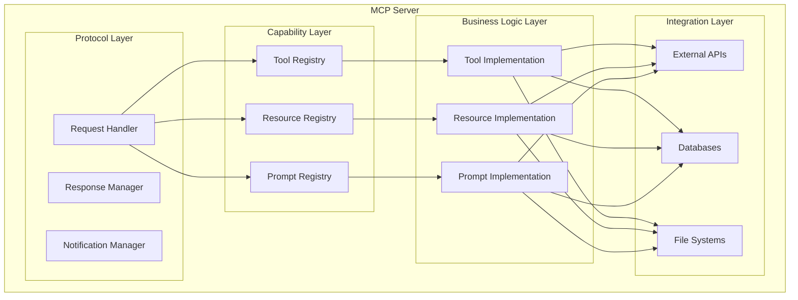

#### Server Capabilities

**Tools**: Executable functions that perform actions on external systems
- Parameter validation using JSON schemas
- Asynchronous execution with progress reporting
- Error handling and recovery mechanisms
- Security sandboxing and permission checking

**Resources**: Read-only access to external data sources
- Dynamic resource discovery and enumeration
- Content type negotiation and format conversion
- Caching and performance optimization
- Access control and filtering

**Prompts**: Reusable templates for AI interactions
- Parameter substitution and template rendering
- Context injection and variable expansion
- Version management and template inheritance
- Usage analytics and optimization

---

## Communication Protocol

MCP's communication protocol is built on JSON-RPC 2.0, providing a reliable, standardized way for clients and servers to exchange information. This section explores the protocol mechanics in detail.

### JSON-RPC 2.0 Foundation

JSON-RPC 2.0 provides the messaging foundation for MCP, defining three types of messages:

#### Request Messages
Requests are sent from client to server to invoke specific operations:

```json
{
  "jsonrpc": "2.0",
  "id": "req-123",
  "method": "tools/call",
  "params": {
    "name": "bash_execute",
    "arguments": {
      "command": "ls -la"
    }
  }
}
```

#### Response Messages
Responses are sent from server to client in reply to requests:

```json
{
  "jsonrpc": "2.0",
  "id": "req-123",
  "result": {
    "content": [
      {
        "type": "text",
        "text": "total 24\ndrwxr-xr-x 3 user user 4096 Dec 15 10:30 .\ndrwxr-xr-x 5 user user 4096 Dec 15 10:25 .."
      }
    ]
  }
}
```

#### Notification Messages
Notifications are one-way messages that don't require responses:

```json
{
  "jsonrpc": "2.0",
  "method": "notifications/progress",
  "params": {
    "progressToken": "operation-456",
    "progress": 0.75,
    "total": 1.0
  }
}
```

### MCP-Specific Protocol Extensions

While MCP uses JSON-RPC as its foundation, it adds several protocol-specific features:

#### Capability Negotiation
During initialization, clients and servers exchange capability information:

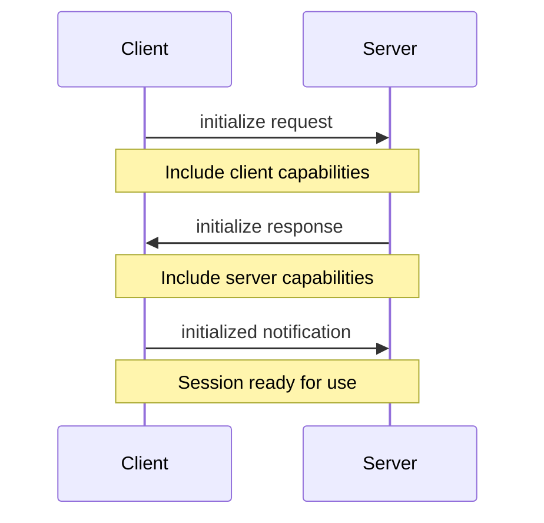

#### Session Management
MCP maintains stateful sessions between clients and servers:

- **Session Initialization**: Establish connection and negotiate capabilities
- **Active Session**: Exchange requests, responses, and notifications
- **Session Cleanup**: Graceful termination and resource cleanup

#### Error Handling
MCP defines standardized error codes and handling mechanisms:

```json
{
  "jsonrpc": "2.0",
  "id": "req-123",
  "error": {
    "code": -32602,
    "message": "Invalid params",
    "data": {
      "parameter": "command",
      "reason": "Command not allowed in current security context"
    }
  }
}
```

### Transport Protocols

MCP supports multiple transport mechanisms to accommodate different deployment scenarios:

#### STDIO Transport
Used for local integrations where the server runs as a subprocess:

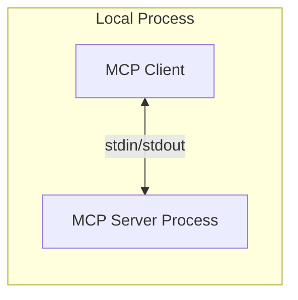

**Characteristics**:
- Simple process-to-process communication
- No network configuration required
- Suitable for development and desktop applications
- Automatic process lifecycle management

#### HTTP+SSE Transport
Used for remote connections with HTTP requests and Server-Sent Events:

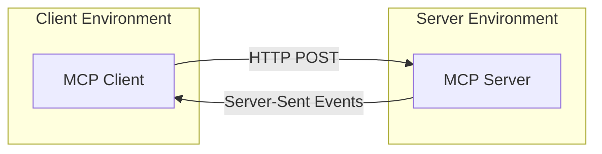

**Characteristics**:
- Scalable for web-based deployments
- Supports firewalls and proxy configurations
- Enables server-initiated notifications
- Standard web technologies for infrastructure

#### Streamable HTTP Transport
Advanced transport for high-performance streaming scenarios:

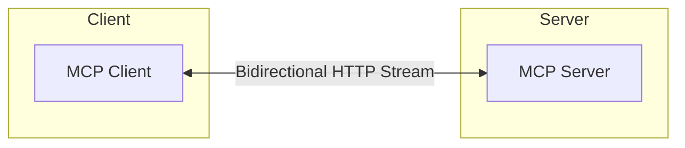

**Characteristics**:
- Full-duplex communication
- Optimized for high-throughput scenarios
- Advanced flow control mechanisms
- Suitable for enterprise deployments

---

## Protocol Lifecycle

Understanding the MCP protocol lifecycle is essential for implementing robust clients and servers. The lifecycle consists of distinct phases, each with specific responsibilities and requirements.

### Initialization Phase

The initialization phase establishes the connection and negotiates capabilities between client and server.

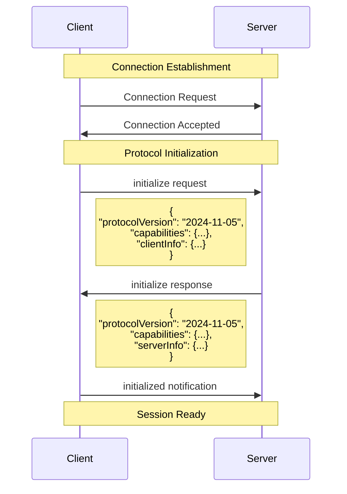

#### Version Negotiation
The client sends its preferred protocol version, and the server responds with a compatible version:

```json
// Client initialize request
{
  "jsonrpc": "2.0",
  "id": 1,
  "method": "initialize",
  "params": {
    "protocolVersion": "2024-11-05",
    "capabilities": {
      "roots": {
        "listChanged": true
      },
      "sampling": {}
    },
    "clientInfo": {
      "name": "ExampleClient",
      "version": "1.0.0"
    }
  }
}

// Server initialize response
{
  "jsonrpc": "2.0",
  "id": 1,
  "result": {
    "protocolVersion": "2024-11-05",
    "capabilities": {
      "logging": {},
      "prompts": {
        "listChanged": true
      },
      "resources": {
        "subscribe": true,
        "listChanged": true
      },
      "tools": {
        "listChanged": true
      }
    },
    "serverInfo": {
      "name": "ExampleServer",
      "version": "1.0.0"
    }
  }
}
```

#### Capability Advertisement
During initialization, both client and server advertise their capabilities:

**Client Capabilities**:
- `roots`: Support for workspace/project roots
- `sampling`: Ability to handle server-initiated LLM requests

**Server Capabilities**:
- `logging`: Support for logging messages
- `prompts`: Availability of prompt templates
- `resources`: Access to external data sources
- `tools`: Executable functions and actions

### Operation Phase

Once initialized, the session enters the operation phase where actual work is performed.

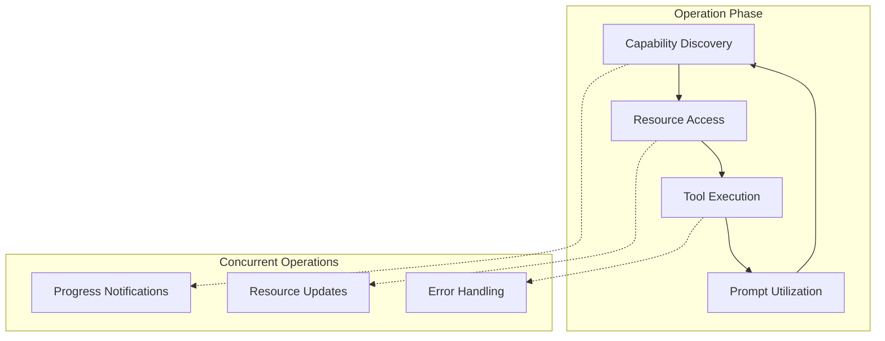

#### Capability Discovery
Clients discover available capabilities through list operations:

```json
// List available tools
{
  "jsonrpc": "2.0",
  "id": 2,
  "method": "tools/list",
  "params": {}
}

// Server response
{
  "jsonrpc": "2.0",
  "id": 2,
  "result": {
    "tools": [
      {
        "name": "bash_execute",
        "description": "Execute bash commands safely",
        "inputSchema": {
          "type": "object",
          "properties": {
            "command": {
              "type": "string",
              "description": "The bash command to execute"
            }
          },
          "required": ["command"]
        }
      }
    ]
  }
}
```

#### Tool Execution
Tools are invoked through the tools/call method:

```json
// Execute a tool
{
  "jsonrpc": "2.0",
  "id": 3,
  "method": "tools/call",
  "params": {
    "name": "bash_execute",
    "arguments": {
      "command": "whoami"
    }
  }
}

// Tool execution result
{
  "jsonrpc": "2.0",
  "id": 3,
  "result": {
    "content": [
      {
        "type": "text",
        "text": "ubuntu"
      }
    ]
  }
}
```

### Shutdown Phase

The shutdown phase gracefully terminates the session and cleans up resources.

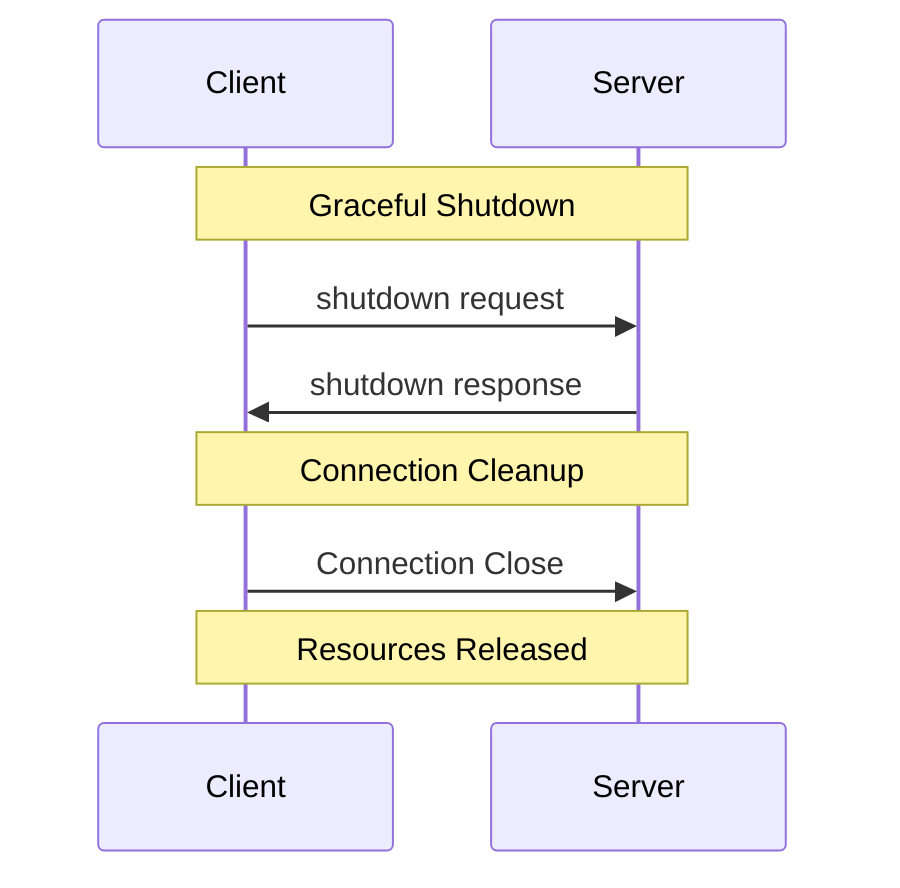

---

## MCP Capabilities

MCP servers expose three primary types of capabilities: Tools, Resources, and Prompts. Each capability type serves a specific purpose in enabling AI models to interact with external systems.

### Tools

Tools represent executable functions that AI models can invoke to perform actions on external systems. They are the "verbs" of the MCP ecosystem.

#### Tool Structure

```json
{
  "name": "bash_execute",
  "description": "Execute bash commands safely in a controlled environment",
  "inputSchema": {
    "type": "object",
    "properties": {
      "command": {
        "type": "string",
        "description": "The bash command to execute"
      },
      "workingDirectory": {
        "type": "string",
        "description": "Working directory for command execution"
      },
      "timeout": {
        "type": "number",
        "description": "Command timeout in seconds",
        "default": 30
      }
    },
    "required": ["command"]
  }
}
```

#### Tool Implementation Workflow

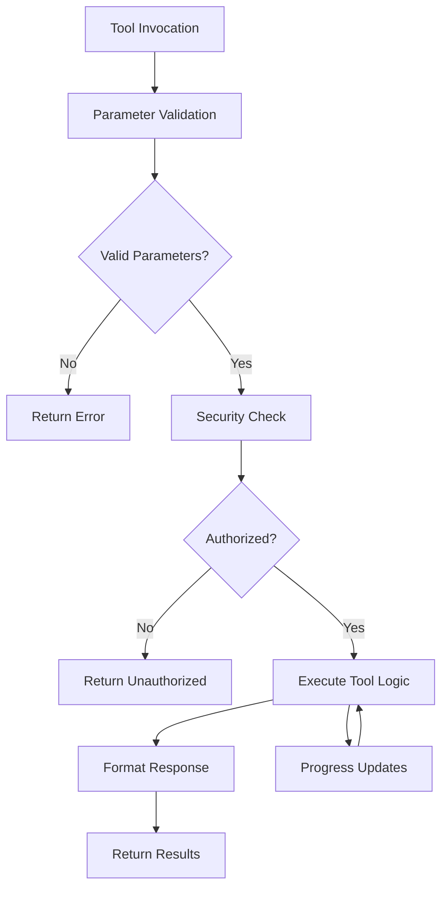

#### Tool Response Format

Tools return structured responses with content arrays:

```json
{
  "content": [
    {
      "type": "text",
      "text": "Command executed successfully:\ntotal 8\ndrwxrwxr-x 3 user user 4096 Dec 15 14:23 .\ndrwxr-xr-x 8 user user 4096 Dec 15 14:20 .."
    }
  ]
}
```

### Resources

Resources provide read-only access to external data sources. They are the "nouns" of the MCP ecosystem, representing information that AI models can read and analyze.

#### Resource Discovery

Resources can be discovered through listing and template mechanisms:

```json
// List available resources
{
  "jsonrpc": "2.0",
  "id": 4,
  "method": "resources/list",
  "params": {}
}

// Server response
{
  "jsonrpc": "2.0",
  "id": 4,
  "result": {
    "resources": [
      {
        "uri": "file:///home/user/projects/config.json",
        "name": "Project Configuration",
        "description": "Main configuration file for the project",
        "mimeType": "application/json"
      }
    ]
  }
}
```

#### Resource Access

Resources are accessed through their URI:

```json
// Read a specific resource
{
  "jsonrpc": "2.0",
  "id": 5,
  "method": "resources/read",
  "params": {
    "uri": "file:///home/user/projects/config.json"
  }
}

// Resource content
{
  "jsonrpc": "2.0",
  "id": 5,
  "result": {
    "contents": [
      {
        "uri": "file:///home/user/projects/config.json",
        "mimeType": "application/json",
        "text": "{\n  \"name\": \"my-project\",\n  \"version\": \"1.0.0\"\n}"
      }
    ]
  }
}
```

#### Resource Templates

Resource templates enable dynamic resource generation:

```json
{
  "resourceTemplates": [
    {
      "uriTemplate": "file:///logs/{date}.log",
      "name": "Daily Log Files",
      "description": "Access log files by date (YYYY-MM-DD format)"
    }
  ]
}
```

### Prompts

Prompts provide reusable templates and instructions that help structure AI model interactions. They enable consistent and effective communication patterns.

#### Prompt Structure

```json
{
  "name": "code_review",
  "description": "Review code for quality and potential issues",
  "arguments": [
    {
      "name": "code",
      "description": "The code to review",
      "required": true
    },
    {
      "name": "language",
      "description": "Programming language",
      "required": false
    }
  ]
}
```

#### Prompt Usage

```json
// Get a prompt
{
  "jsonrpc": "2.0",
  "id": 6,
  "method": "prompts/get",
  "params": {
    "name": "code_review",
    "arguments": {
      "code": "function add(a, b) { return a + b; }",
      "language": "javascript"
    }
  }
}

// Prompt response
{
  "jsonrpc": "2.0",
  "id": 6,
  "result": {
    "description": "Code review prompt for JavaScript code",
    "messages": [
      {
        "role": "user",
        "content": {
          "type": "text",
          "text": "Please review the following JavaScript code for quality, potential issues, and best practices:\n\n```javascript\nfunction add(a, b) { return a + b; }\n```"
        }
      }
    ]
  }
}
```

---

## Implementation Examples

This section provides practical examples of implementing MCP components, starting with simple scenarios and building up to more complex use cases.

### Basic MCP Server Structure

Here's the foundation for a TypeScript MCP server:

```typescript
import { Server } from '@modelcontextprotocol/sdk/server/index.js';
import { StdioServerTransport } from '@modelcontextprotocol/sdk/server/stdio.js';
import { 
  CallToolRequestSchema,
  ListToolsRequestSchema,
  Tool
} from '@modelcontextprotocol/sdk/types.js';

class BasicMCPServer {
  private server: Server;
  
  constructor() {
    this.server = new Server(
      {
        name: 'basic-mcp-server',
        version: '1.0.0',
      },
      {
        capabilities: {
          tools: {},
        },
      }
    );
    
    this.setupToolHandlers();
  }
  
  private setupToolHandlers() {
    // Register tool listing handler
    this.server.setRequestHandler(ListToolsRequestSchema, async () => {
      return {
        tools: this.getAvailableTools(),
      };
    });
    
    // Register tool execution handler
    this.server.setRequestHandler(CallToolRequestSchema, async (request) => {
      const { name, arguments: args } = request.params;
      return await this.executeTool(name, args || {});
    });
  }
  
  private getAvailableTools(): Tool[] {
    return [
      {
        name: 'echo',
        description: 'Echo back the provided message',
        inputSchema: {
          type: 'object',
          properties: {
            message: {
              type: 'string',
              description: 'Message to echo back',
            },
          },
          required: ['message'],
        },
      },
    ];
  }
  
  private async executeTool(name: string, args: any) {
    switch (name) {
      case 'echo':
        return {
          content: [
            {
              type: 'text',
              text: `Echo: ${args.message}`,
            },
          ],
        };
      default:
        throw new Error(`Unknown tool: ${name}`);
    }
  }
  
  async start() {
    const transport = new StdioServerTransport();
    await this.server.connect(transport);
  }
}

// Start the server
const server = new BasicMCPServer();
server.start().catch(console.error);
```

### Enhanced Tool Implementation with Validation

```typescript
import { z } from 'zod';
import { exec } from 'child_process';
import { promisify } from 'util';

const execAsync = promisify(exec);

// Input validation schemas
const BashExecuteSchema = z.object({
  command: z.string().min(1, 'Command cannot be empty'),
  workingDirectory: z.string().optional(),
  timeout: z.number().positive().max(300).default(30),
});

class EnhancedMCPServer {
  private server: Server;
  
  constructor() {
    this.server = new Server(
      {
        name: 'enhanced-mcp-server',
        version: '1.0.0',
      },
      {
        capabilities: {
          tools: {},
        },
      }
    );
    
    this.setupToolHandlers();
  }
  
  private setupToolHandlers() {
    this.server.setRequestHandler(ListToolsRequestSchema, async () => {
      return {
        tools: [
          {
            name: 'bash_execute',
            description: 'Execute bash commands safely',
            inputSchema: {
              type: 'object',
              properties: {
                command: {
                  type: 'string',
                  description: 'The bash command to execute',
                  minLength: 1,
                },
                workingDirectory: {
                  type: 'string',
                  description: 'Working directory for execution',
                },
                timeout: {
                  type: 'number',
                  description: 'Timeout in seconds (max 300)',
                  minimum: 1,
                  maximum: 300,
                  default: 30,
                },
              },
              required: ['command'],
            },
          },
          {
            name: 'list_directory',
            description: 'List directory contents',
            inputSchema: {
              type: 'object',
              properties: {
                path: {
                  type: 'string',
                  description: 'Directory path to list',
                  default: '.',
                },
                showHidden: {
                  type: 'boolean',
                  description: 'Show hidden files',
                  default: false,
                },
              },
            },
          },
          {
            name: 'get_user_info',
            description: 'Get current user information',
            inputSchema: {
              type: 'object',
              properties: {},
            },
          },
        ],
      };
    });
    
    this.server.setRequestHandler(CallToolRequestSchema, async (request) => {
      const { name, arguments: args } = request.params;
      
      try {
        switch (name) {
          case 'bash_execute':
            return await this.executeBashCommand(args);
          case 'list_directory':
            return await this.listDirectory(args);
          case 'get_user_info':
            return await this.getUserInfo();
          default:
            throw new Error(`Unknown tool: ${name}`);
        }
      } catch (error) {
        return {
          content: [
            {
              type: 'text',
              text: `Error executing tool ${name}: ${error.message}`,
            },
          ],
          isError: true,
        };
      }
    });
  }
  
  private async executeBashCommand(args: any) {
    // Validate input
    const validatedArgs = BashExecuteSchema.parse(args);
    const { command, workingDirectory, timeout } = validatedArgs;
    
    // Security check - block dangerous commands
    const dangerousCommands = [
      'rm -rf /',
      'format',
      'del /f /s /q',
      'shutdown',
      'reboot',
    ];
    
    if (dangerousCommands.some(dangerous => 
      command.toLowerCase().includes(dangerous)
    )) {
      throw new Error('Command blocked for security reasons');
    }
    
    try {
      const { stdout, stderr } = await execAsync(command, {
        cwd: workingDirectory || process.cwd(),
        timeout: timeout * 1000,
        maxBuffer: 1024 * 1024, // 1MB limit
      });
      
      return {
        content: [
          {
            type: 'text',
            text: `Command: ${command}\n\nOutput:\n${stdout}${stderr ? `\nErrors:\n${stderr}` : ''}`,
          },
        ],
      };
    } catch (error) {
      return {
        content: [
          {
            type: 'text',
            text: `Command failed: ${command}\nError: ${error.message}`,
          },
        ],
        isError: true,
      };
    }
  }
  
  private async listDirectory(args: any) {
    const path = args?.path || '.';
    const showHidden = args?.showHidden || false;
    
    const command = showHidden ? `ls -la "${path}"` : `ls -l "${path}"`;
    
    return this.executeBashCommand({ command });
  }
  
  private async getUserInfo() {
    return this.executeBashCommand({ command: 'whoami' });
  }
}
```

### Resource Implementation Example

```typescript
import { 
  ListResourcesRequestSchema,
  ReadResourceRequestSchema,
  Resource
} from '@modelcontextprotocol/sdk/types.js';
import { readFile } from 'fs/promises';
import path from 'path';

class ResourceServer {
  private server: Server;
  private rootPath: string;
  
  constructor(rootPath: string = process.cwd()) {
    this.rootPath = rootPath;
    this.server = new Server(
      {
        name: 'resource-server',
        version: '1.0.0',
      },
      {
        capabilities: {
          resources: {},
        },
      }
    );
    
    this.setupResourceHandlers();
  }
  
  private setupResourceHandlers() {
    this.server.setRequestHandler(ListResourcesRequestSchema, async () => {
      return {
        resources: await this.discoverResources(),
      };
    });
    
    this.server.setRequestHandler(ReadResourceRequestSchema, async (request) => {
      const { uri } = request.params;
      return await this.readResource(uri);
    });
  }
  
  private async discoverResources(): Promise<Resource[]> {
    const resources: Resource[] = [];
    
    // Add common configuration files
    const commonFiles = [
      'package.json',
      'tsconfig.json',
      'README.md',
      '.env.example',
    ];
    
    for (const file of commonFiles) {
      const filePath = path.join(this.rootPath, file);
      try {
        await readFile(filePath);
        resources.push({
          uri: `file://${filePath}`,
          name: file,
          description: `Configuration file: ${file}`,
          mimeType: this.getMimeType(file),
        });
      } catch {
        // File doesn't exist, skip
      }
    }
    
    return resources;
  }
  
  private async readResource(uri: string) {
    if (!uri.startsWith('file://')) {
      throw new Error('Only file:// URIs are supported');
    }
    
    const filePath = uri.substring(7); // Remove 'file://'
    
    // Security check - ensure file is within allowed directory
    const resolvedPath = path.resolve(filePath);
    const resolvedRoot = path.resolve(this.rootPath);
    
    if (!resolvedPath.startsWith(resolvedRoot)) {
      throw new Error('Access denied: File outside allowed directory');
    }
    
    try {
      const content = await readFile(filePath, 'utf-8');
      
      return {
        contents: [
          {
            uri,
            mimeType: this.getMimeType(filePath),
            text: content,
          },
        ],
      };
    } catch (error) {
      throw new Error(`Failed to read file: ${error.message}`);
    }
  }
  
  private getMimeType(filename: string): string {
    const ext = path.extname(filename).toLowerCase();
    const mimeTypes: Record<string, string> = {
      '.json': 'application/json',
      '.js': 'application/javascript',
      '.ts': 'application/typescript',
      '.md': 'text/markdown',
      '.txt': 'text/plain',
      '.env': 'text/plain',
    };
    
    return mimeTypes[ext] || 'text/plain';
  }
}
```

---

## Complete NestJS MCP Server Implementation

This section presents a comprehensive implementation of an MCP server using NestJS framework, demonstrating enterprise-grade patterns and best practices.

### Project Structure

```
bash-mcp-server/
├── src/
│   ├── app.module.ts
│   ├── main.ts
│   ├── mcp/
│   │   ├── mcp.module.ts
│   │   ├── mcp.service.ts
│   │   └── transports/
│   │       ├── stdio.transport.ts
│   │       └── http.transport.ts
│   ├── tools/
│   │   ├── tools.module.ts
│   │   ├── tools.service.ts
│   │   ├── bash/
│   │   │   ├── bash.tool.ts
│   │   │   └── bash.validator.ts
│   │   └── dto/
│   │       └── tool-execution.dto.ts
│   ├── security/
│   │   ├── security.module.ts
│   │   ├── command.guard.ts
│   │   └── sanitizer.service.ts
│   └── common/
│       ├── interfaces/
│       │   └── mcp.interfaces.ts
│       └── decorators/
│           └── mcp-tool.decorator.ts
├── package.json
├── tsconfig.json
└── nest-cli.json
```

### Core MCP Module

```typescript
// src/mcp/mcp.module.ts
import { Module } from '@nestjs/common';
import { McpService } from './mcp.service';
import { ToolsModule } from '../tools/tools.module';
import { SecurityModule } from '../security/security.module';

@Module({
  imports: [ToolsModule, SecurityModule],
  providers: [McpService],
  exports: [McpService],
})
export class McpModule {}
```

### MCP Service Implementation

```typescript
// src/mcp/mcp.service.ts
import { Injectable, OnModuleInit, Logger } from '@nestjs/common';
import { Server } from '@modelcontextprotocol/sdk/server/index.js';
import { StdioServerTransport } from '@modelcontextprotocol/sdk/server/stdio.js';
import {
  CallToolRequestSchema,
  ListToolsRequestSchema,
  Tool,
} from '@modelcontextprotocol/sdk/types.js';
import { ToolsService } from '../tools/tools.service';
import { McpToolDefinition, ToolExecutionResult } from '../common/interfaces/mcp.interfaces';

@Injectable()
export class McpService implements OnModuleInit {
  private readonly logger = new Logger(McpService.name);
  private server: Server;

  constructor(private readonly toolsService: ToolsService) {}

  async onModuleInit() {
    await this.initializeServer();
    await this.startServer();
  }

  private async initializeServer() {
    this.server = new Server(
      {
        name: 'nestjs-bash-mcp-server',
        version: '1.0.0',
      },
      {
        capabilities: {
          tools: {},
          logging: {},
        },
      }
    );

    this.setupRequestHandlers();
    this.logger.log('MCP Server initialized');
  }

  private setupRequestHandlers() {
    // Handle tool listing requests
    this.server.setRequestHandler(ListToolsRequestSchema, async () => {
      const tools = await this.toolsService.getAvailableTools();
      this.logger.debug(`Listing ${tools.length} available tools`);
      
      return {
        tools: tools.map(this.convertToMcpTool),
      };
    });

    // Handle tool execution requests
    this.server.setRequestHandler(CallToolRequestSchema, async (request) => {
      const { name, arguments: args } = request.params;
      this.logger.debug(`Executing tool: ${name} with args:`, args);

      try {
        const result = await this.toolsService.executeTool(name, args || {});
        return this.formatToolResult(result);
      } catch (error) {
        this.logger.error(`Tool execution failed: ${error.message}`, error.stack);
        return this.formatErrorResult(error.message);
      }
    });
  }

  private convertToMcpTool(toolDef: McpToolDefinition): Tool {
    return {
      name: toolDef.name,
      description: toolDef.description,
      inputSchema: toolDef.inputSchema,
    };
  }

  private formatToolResult(result: ToolExecutionResult) {
    return {
      content: [
        {
          type: 'text',
          text: result.output,
        },
      ],
      isError: result.isError || false,
    };
  }

  private formatErrorResult(errorMessage: string) {
    return {
      content: [
        {
          type: 'text',
          text: `Error: ${errorMessage}`,
        },
      ],
      isError: true,
    };
  }

  private async startServer() {
    try {
      const transport = new StdioServerTransport();
      await this.server.connect(transport);
      this.logger.log('MCP Server started successfully');
    } catch (error) {
      this.logger.error('Failed to start MCP Server:', error);
      throw error;
    }
  }
}
```

### Tools Service Implementation

```typescript
// src/tools/tools.service.ts
import { Injectable, Logger } from '@nestjs/common';
import { ModuleRef } from '@nestjs/core';
import { McpToolDefinition, ToolExecutionResult } from '../common/interfaces/mcp.interfaces';
import { BashTool } from './bash/bash.tool';

@Injectable()
export class ToolsService {
  private readonly logger = new Logger(ToolsService.name);
  private readonly tools = new Map<string, any>();

  constructor(
    private readonly moduleRef: ModuleRef,
    private readonly bashTool: BashTool,
  ) {
    this.registerTools();
  }

  private registerTools() {
    // Register bash execution tools
    this.tools.set('bash_execute', this.bashTool);
    this.tools.set('list_directory', this.bashTool);
    this.tools.set('get_user_info', this.bashTool);

    this.logger.log(`Registered ${this.tools.size} tools`);
  }

  async getAvailableTools(): Promise<McpToolDefinition[]> {
    const toolDefinitions: McpToolDefinition[] = [];

    for (const [name, tool] of this.tools) {
      if (tool.getToolDefinition) {
        const definitions = await tool.getToolDefinition();
        toolDefinitions.push(...(Array.isArray(definitions) ? definitions : [definitions]));
      }
    }

    return toolDefinitions;
  }

  async executeTool(name: string, args: Record<string, any>): Promise<ToolExecutionResult> {
    this.logger.debug(`Executing tool: ${name}`);

    for (const [, tool] of this.tools) {
      if (tool.canHandle && tool.canHandle(name)) {
        return await tool.execute(name, args);
      }
    }

    throw new Error(`Tool not found: ${name}`);
  }
}
```

### Bash Tool Implementation

```typescript
// src/tools/bash/bash.tool.ts
import { Injectable, Logger } from '@nestjs/common';
import { exec } from 'child_process';
import { promisify } from 'util';
import { CommandGuard } from '../../security/command.guard';
import { SanitizerService } from '../../security/sanitizer.service';
import { BashCommandValidator } from './bash.validator';
import { McpToolDefinition, ToolExecutionResult } from '../../common/interfaces/mcp.interfaces';

const execAsync = promisify(exec);

@Injectable()
export class BashTool {
  private readonly logger = new Logger(BashTool.name);

  constructor(
    private readonly commandGuard: CommandGuard,
    private readonly sanitizer: SanitizerService,
    private readonly validator: BashCommandValidator,
  ) {}

  canHandle(toolName: string): boolean {
    return ['bash_execute', 'list_directory', 'get_user_info'].includes(toolName);
  }

  getToolDefinition(): McpToolDefinition[] {
    return [
      {
        name: 'bash_execute',
        description: 'Execute bash commands safely with security controls',
        inputSchema: {
          type: 'object',
          properties: {
            command: {
              type: 'string',
              description: 'The bash command to execute',
              minLength: 1,
            },
            workingDirectory: {
              type: 'string',
              description: 'Working directory for command execution',
            },
            timeout: {
              type: 'number',
              description: 'Timeout in seconds (max 300)',
              minimum: 1,
              maximum: 300,
              default: 30,
            },
          },
          required: ['command'],
        },
      },
      {
        name: 'list_directory',
        description: 'List contents of a directory',
        inputSchema: {
          type: 'object',
          properties: {
            path: {
              type: 'string',
              description: 'Directory path to list',
              default: '.',
            },
            showHidden: {
              type: 'boolean',
              description: 'Show hidden files and directories',
              default: false,
            },
            longFormat: {
              type: 'boolean',
              description: 'Use long listing format',
              default: true,
            },
          },
        },
      },
      {
        name: 'get_user_info',
        description: 'Get information about the current user',
        inputSchema: {
          type: 'object',
          properties: {},
        },
      },
    ];
  }

  async execute(toolName: string, args: Record<string, any>): Promise<ToolExecutionResult> {
    this.logger.debug(`Executing ${toolName} with args:`, args);

    switch (toolName) {
      case 'bash_execute':
        return this.executeBashCommand(args);
      case 'list_directory':
        return this.listDirectory(args);
      case 'get_user_info':
        return this.getUserInfo();
      default:
        throw new Error(`Unsupported tool: ${toolName}`);
    }
  }

  private async executeBashCommand(args: Record<string, any>): Promise<ToolExecutionResult> {
    // Validate input parameters
    const validatedArgs = this.validator.validateBashCommand(args);
    const { command, workingDirectory, timeout } = validatedArgs;

    // Security checks
    if (!this.commandGuard.isCommandAllowed(command)) {
      return {
        output: `Command blocked by security policy: ${command}`,
        isError: true,
      };
    }

    try {
      const { stdout, stderr } = await execAsync(command, {
        cwd: workingDirectory || process.cwd(),
        timeout: timeout * 1000,
        maxBuffer: 1024 * 1024, // 1MB limit
      });

      const sanitizedOutput = this.sanitizer.sanitizeOutput(stdout);
      const sanitizedError = stderr ? this.sanitizer.sanitizeOutput(stderr) : '';

      const output = [
        `Command: ${command}`,
        `Working Directory: ${workingDirectory || process.cwd()}`,
        '',
        'Output:',
        sanitizedOutput,
        sanitizedError ? `\nErrors:\n${sanitizedError}` : '',
      ].join('\n');

      return {
        output: output.trim(),
        isError: false,
      };
    } catch (error) {
      this.logger.error(`Command execution failed: ${error.message}`);
      
      return {
        output: `Command execution failed: ${command}\nError: ${error.message}`,
        isError: true,
      };
    }
  }

  private async listDirectory(args: Record<string, any>): Promise<ToolExecutionResult> {
    const path = args.path || '.';
    const showHidden = args.showHidden || false;
    const longFormat = args.longFormat !== false; // Default to true

    let command = 'ls';
    if (longFormat) command += ' -l';
    if (showHidden) command += ' -a';
    command += ` "${path}"`;

    return this.executeBashCommand({ command });
  }

  private async getUserInfo(): Promise<ToolExecutionResult> {
    const commands = [
      'whoami',
      'id',
      'pwd',
    ];

    const results: string[] = [];
    
    for (const command of commands) {
      try {
        const result = await this.executeBashCommand({ command });
        results.push(`${command}:\n${result.output}\n`);
      } catch (error) {
        results.push(`${command}: Error - ${error.message}\n`);
      }
    }

    return {
      output: results.join('\n'),
      isError: false,
    };
  }
}
```

### Security Implementation

```typescript
// src/security/command.guard.ts
import { Injectable, Logger } from '@nestjs/common';

@Injectable()
export class CommandGuard {
  private readonly logger = new Logger(CommandGuard.name);

  private readonly dangerousCommands = [
    // Destructive operations
    'rm -rf /',
    'format',
    'del /f /s /q',
    'mkfs',
    'fdisk',
    
    // System control
    'shutdown',
    'reboot',
    'halt',
    'init',
    'systemctl',
    
    // Network operations that could be dangerous
    'nc -l', // netcat listener
    'nmap',
    
    // Process manipulation
    'kill -9 1', // kill init
    'killall',
    
    // File system operations
    'chmod 777 /',
    'chown -R',
  ];

  private readonly allowedCommands = [
    'ls',
    'dir',
    'pwd',
    'whoami',
    'id',
    'date',
    'echo',
    'cat',
    'head',
    'tail',
    'grep',
    'find',
    'wc',
    'sort',
    'uniq',
  ];

  isCommandAllowed(command: string): boolean {
    const lowerCommand = command.toLowerCase().trim();

    // Check if command starts with an explicitly allowed command
    const commandParts = lowerCommand.split(/\s+/);
    const baseCommand = commandParts[0];

    if (this.allowedCommands.includes(baseCommand)) {
      // Additional checks for allowed commands
      return this.validateAllowedCommand(command);
    }

    // Check for dangerous patterns
    if (this.containsDangerousPattern(lowerCommand)) {
      this.logger.warn(`Blocked dangerous command: ${command}`);
      return false;
    }

    // For commands not in allowed list, apply stricter validation
    return this.validateGeneralCommand(command);
  }

  private containsDangerousPattern(command: string): boolean {
    return this.dangerousCommands.some(dangerous => 
      command.includes(dangerous.toLowerCase())
    );
  }

  private validateAllowedCommand(command: string): boolean {
    // Additional validation for allowed commands
    // e.g., ensure no command injection
    return !command.includes('&&') && 
           !command.includes('||') && 
           !command.includes(';') &&
           !command.includes('|') &&
           !command.includes('>`');
  }

  private validateGeneralCommand(command: string): boolean {
    // More restrictive validation for general commands
    // Only allow simple commands without complex operations
    return command.length < 200 && // Reasonable length limit
           !command.includes('&&') &&
           !command.includes('||') &&
           !command.includes(';') &&
           !/[<>|&]/.test(command); // No redirection or pipes
  }
}

// src/security/sanitizer.service.ts
import { Injectable } from '@nestjs/common';

@Injectable()
export class SanitizerService {
  private readonly maxOutputLength = 10000; // 10KB limit

  sanitizeOutput(output: string): string {
    if (!output) return '';

    // Truncate if too long
    let sanitized = output.length > this.maxOutputLength 
      ? output.substring(0, this.maxOutputLength) + '\n... (output truncated)'
      : output;

    // Remove or escape potentially dangerous content
    sanitized = this.removeSensitiveInfo(sanitized);
    sanitized = this.escapeControlCharacters(sanitized);

    return sanitized;
  }

  private removeSensitiveInfo(output: string): string {
    // Remove potential password patterns
    return output
      .replace(/password[=:]\s*\S+/gi, 'password=[REDACTED]')
      .replace(/token[=:]\s*\S+/gi, 'token=[REDACTED]')
      .replace(/key[=:]\s*\S+/gi, 'key=[REDACTED]')
      .replace(/secret[=:]\s*\S+/gi, 'secret=[REDACTED]');
  }

  private escapeControlCharacters(output: string): string {
    // Remove or escape dangerous control characters
    return output
      .replace(/\x1b\[[0-9;]*[mGKH]/g, '') // Remove ANSI escape codes
      .replace(/[\x00-\x08\x0B\x0C\x0E-\x1F\x7F]/g, ''); // Remove control chars
  }
}
```

### Validation Implementation

```typescript
// src/tools/bash/bash.validator.ts
import { Injectable, BadRequestException } from '@nestjs/common';
import { z } from 'zod';

const BashCommandSchema = z.object({
  command: z.string().min(1, 'Command cannot be empty').max(500, 'Command too long'),
  workingDirectory: z.string().optional(),
  timeout: z.number().positive().max(300).default(30),
});

type BashCommandArgs = z.infer<typeof BashCommandSchema>;

@Injectable()
export class BashCommandValidator {
  validateBashCommand(args: any): BashCommandArgs {
    try {
      return BashCommandSchema.parse(args);
    } catch (error) {
      if (error instanceof z.ZodError) {
        const messages = error.errors.map(err => `${err.path.join('.')}: ${err.message}`);
        throw new BadRequestException(`Validation failed: ${messages.join(', ')}`);
      }
      throw new BadRequestException('Invalid command arguments');
    }
  }
}
```

### Application Bootstrap

```typescript
// src/main.ts
import { NestFactory } from '@nestjs/core';
import { AppModule } from './app.module';
import { Logger } from '@nestjs/common';

async function bootstrap() {
  const logger = new Logger('Bootstrap');
  
  try {
    const app = await NestFactory.create(AppModule, {
      logger: ['error', 'warn', 'log', 'debug'],
    });

    // The MCP service will start automatically via OnModuleInit
    // No need to start an HTTP server for STDIO transport
    
    logger.log('NestJS MCP Server application started');
    
    // Keep the process running
    await app.init();
    
  } catch (error) {
    logger.error('Failed to start application:', error);
    process.exit(1);
  }
}

bootstrap();

// src/app.module.ts
import { Module } from '@nestjs/common';
import { McpModule } from './mcp/mcp.module';
import { ToolsModule } from './tools/tools.module';
import { SecurityModule } from './security/security.module';

@Module({
  imports: [McpModule, ToolsModule, SecurityModule],
})
export class AppModule {}
```

### Interface Definitions

```typescript
// src/common/interfaces/mcp.interfaces.ts
export interface McpToolDefinition {
  name: string;
  description: string;
  inputSchema: {
    type: string;
    properties: Record<string, any>;
    required?: string[];
  };
}

export interface ToolExecutionResult {
  output: string;
  isError: boolean;
}

export interface McpCapabilities {
  tools?: Record<string, any>;
  resources?: Record<string, any>;
  prompts?: Record<string, any>;
  logging?: Record<string, any>;
}
```

### Package Configuration

```json
// package.json
{
  "name": "nestjs-bash-mcp-server",
  "version": "1.0.0",
  "description": "A comprehensive MCP server built with NestJS for safe bash command execution",
  "main": "dist/main.js",
  "scripts": {
    "build": "nest build",
    "start": "nest start",
    "start:dev": "nest start --watch",
    "start:prod": "node dist/main",
    "test": "jest",
    "test:watch": "jest --watch",
    "test:cov": "jest --coverage"
  },
  "dependencies": {
    "@nestjs/common": "^10.0.0",
    "@nestjs/core": "^10.0.0",
    "@nestjs/platform-express": "^10.0.0",
    "@modelcontextprotocol/sdk": "^0.6.1",
    "zod": "^3.22.0",
    "reflect-metadata": "^0.1.13",
    "rxjs": "^7.8.1"
  },
  "devDependencies": {
    "@nestjs/cli": "^10.0.0",
    "@nestjs/schematics": "^10.0.0",
    "@nestjs/testing": "^10.0.0",
    "@types/jest": "^29.5.2",
    "@types/node": "^20.3.1",
    "@typescript-eslint/eslint-plugin": "^6.0.0",
    "@typescript-eslint/parser": "^6.0.0",
    "eslint": "^8.42.0",
    "jest": "^29.5.0",
    "prettier": "^3.0.0",
    "source-map-support": "^0.5.21",
    "ts-jest": "^29.1.0",
    "ts-loader": "^9.4.3",
    "ts-node": "^10.9.1",
    "tsconfig-paths": "^4.2.1",
    "typescript": "^5.1.3"
  }
}
```

### Usage Instructions

To use this NestJS MCP server:

1. **Installation**:
   ```bash
   npm install
   npm run build
   ```

2. **Running the Server**:
   ```bash
   npm run start:prod
   ```

3. **Configuration in Claude Desktop**:
   ```json
   {
     "mcpServers": {
       "nestjs-bash-server": {
         "command": "node",
         "args": ["/path/to/your/project/dist/main.js"]
       }
     }
   }
   ```

4. **Testing Tools**:
   The server exposes three main tools:
   - `bash_execute`: Execute arbitrary bash commands with security controls
   - `list_directory`: List directory contents with formatting options
   - `get_user_info`: Get current user and system information

This implementation demonstrates enterprise-grade practices including:
- Comprehensive input validation using Zod
- Multi-layered security with command filtering and output sanitization
- Proper error handling and logging
- Modular architecture with dependency injection
- Type-safe interfaces and DTOs
- Configurable security policies

---

## References

[^1]: Anthropic. "Introducing the Model Context Protocol." Anthropic, November 24, 2024. https://www.anthropic.com/news/model-context-protocol

[^2]: Anthropic API Documentation. "Model Context Protocol (MCP)." December 20, 2023. https://docs.anthropic.com/en/docs/mcp

[^3]: Claude MCP Community. "Protocol Specification." September 6, 2025. https://www.claudemcp.com/specification

[^4]: Hugging Face MCP Course. "Architectural Components of MCP." https://huggingface.co/learn/mcp-course/unit1/architectural-components

[^5]: Model Context Protocol Documentation. "Architecture overview." December 20, 2023. https://modelcontextprotocol.io/docs/concepts/architecture

[^6]: Model Context Protocol Documentation. "Understanding MCP clients." December 20, 2023. https://modelcontextprotocol.io/docs/learn/client-concepts

[^7]: MCPcat. "JSON-RPC Protocol in MCP - Complete Guide." March 25, 2025. https://mcpcat.io/guides/understanding-json-rpc-protocol-mcp/

[^8]: Model Context Protocol Specification. "Specification." June 17, 2025. https://modelcontextprotocol.io/specification/2025-06-18

[^9]: Stainless. "MCP Specification." September 3, 2025. https://www.stainless.com/mcp/mcp-specification

[^10]: Model Context Protocol Documentation. "Build an MCP server." December 20, 2023. https://modelcontextprotocol.io/quickstart/server

[^11]: Milvus. "How is JSON-RPC used in the Model Context Protocol?" August 24, 2025. https://milvus.io/ai-quick-reference/how-is-jsonrpc-used-in-the-model-context-protocol

[^12]: GitHub. "The official TypeScript SDK for Model Context Protocol servers and clients." September 23, 2024. https://github.com/modelcontextprotocol/typescript-sdk

[^13]: Composio. "MCP server: A step-by-step guide to building from scratch." September 4, 2025. https://composio.dev/blog/mcp-server-step-by-step-guide-to-building-from-scrtch

[^14]: TheMLArchitect. "The Architectural Elegance of Model Context Protocol (MCP)." June 7, 2025. https://themlarchitect.com/blog/the-architectural-elegance-of-model-context-protocol-mcp/

[^15]: GitHub Survey. "A Survey of the Model Context Protocol (MCP)." March 22, 2025. https://github.com/asinghcsu/model-context-protocol-survey

[^16]: Descope. "What Is the Model Context Protocol (MCP) and How It Works." September 4, 2025. https://www.descope.com/learn/post/mcp